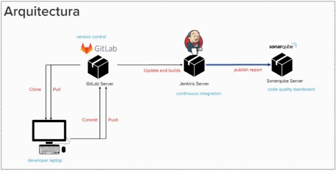
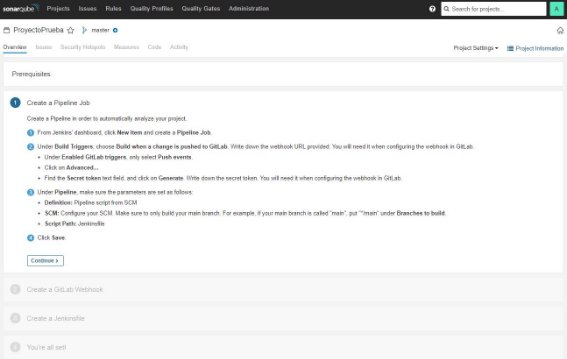
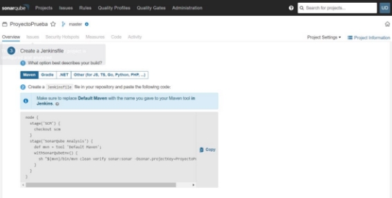
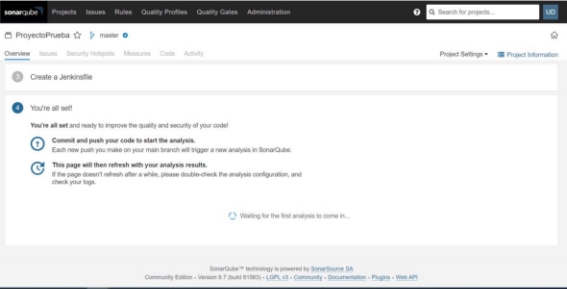
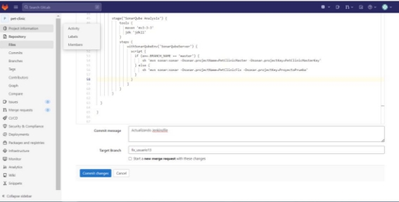
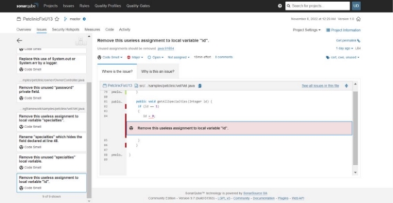
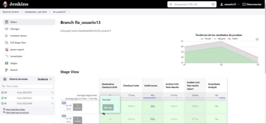



**Guía 1 Introducción a integración continua Versión 1.1** 

INFORMACIÓN GENERAL 

Con el apoyo de esta guía pondremos en práctica prácticas básicas de integración continua. Al finalizar esta guía, habrás aprendido: 

- Cómo crear y configurar sonarqube 
- Conocerás de qué se tratan los webhooks y cómo usarlos al integrar Jenkins, Sonarqube y gitLab 
- Uso de archivo de configuración de Jenkins para la creación de pipelines 
- Interpretar los datos arrojados por sonarqube tras su análisis estático de código. 
- Identificar el estado de los pipelines en Jenkins, conocido como weather. 
- Crear ramas para realizar un fix.  

ANTES DE EMPEZAR… 

Conozcamos la arquitectura que nos proporciona la integración continua. Como lo vemos en la siguiente imagen, tenemos un servidor con GitLab (el cual se encarga del versionamiento del código), un servidor con Jenkins (el cual se integra y orquesta cada actualización o construcción de código) y, por último, un servidor con sonarqube, que es la herramienta que nos dará el resultado en buenas prácticas, vulnerabilidades y bugs a nivel de código, entre otros. 

**Ahora sí, iniciemos…** 

ACCESOS 

1. **GitLab:**  
1. Ingresa a la url:[** https://versionserver.eastus.cloudapp.azure.com/ ](https://versionserver.eastus.cloudapp.azure.com/)** 
1. Con los datos de acceso indicados para iniciar sesión.** 
2. **Jenkins:** 
1. Ingresa a la url:[ https://jenkinsmainserver.eastus.cloudapp.azure.com/ ](https://jenkinsmainserver.eastus.cloudapp.azure.com/)
1. Con los datos de acceso indicados para iniciar sesión. 
3. **Sonarqube**: 
1. Ingresa a la url:[ https://sonarqserver.eastus.cloudapp.azure.com/ ](https://sonarqserver.eastus.cloudapp.azure.com/)
1. Con los datos de acceso indicados para iniciar sesión. 

NAVEGACIÓN Y RECONOCIMIENTO. 

1. Accedemos a GitLab: Para efectos de esta guía usaremos el proyecto [‘**pet-clinic**’](https://versionserver.eastus.cloudapp.azure.com/estudiantes/pet-clinic), sin embargo, los pasos son los mismos sin importar el proyecto. Damos clic en el proyecto: 

2. Allí encontraremos nuestro código fuente con un archivo de importancia, se llama **Jenkinsfile**, el cual es un archivo que tiene las instrucciones para integrar GitLab con SonarQube a través de Jenkins. 

3. Ahora, accedemos a sonarQube, y podemos observar vemos el proyecto de PetClinic analizado previamente. Identifiquemos cuál es su resultado, para ello realizamos clic sobre ‘petclinicmain’ 

4. Al ingresar al detalle, encontramos: 

5. Como podemos observar, hay 9 vulnerabilidades, 1 security hotspots y 27 code smells. ¡Es tiempo de solucionarlos! Selecciona uno para solucionar, para ello haz clic en cualquiera de los ítems mencionados previamente: 

6. Como puedes observar, Sonarqube te brinda una guía o posible causa de por qué se considera una vulnerabilidad, code smell o hotspost y dónde está ubicado. Solo debes dar clic sobre el issue: 

CONFIGURACIÓN 

Sonarqube 

1. Una vez identificado el issue a resolver, damos clic en ‘Proyectos’: 

2. Ahora vamos a iniciar a realizar la creación para analizar nuestro proyecto. Para ello, nos aparecen tres opciones dependiendo de la herramienta DevOps que tenemos disponible basado en los que disponibiliza en primera instancia SonarQube. En nuestro caso, seleccionamos manualmente: 

3. Una vez le hacemos clic, nos lleva a la siguiente pantalla donde debemos diligenciar ‘Project Display Name y luego en ‘Project Key’. 

4. Para nuestro caso de ejemplo, usaremos ‘ProyectoPrueba’: 

5. Damos clic en ‘Set Up’, y nos redirige a la pantalla principal y veremos el proyecto recién creado. Hacemos clic sobre él. 

6. Ahora vamos a realizar la configuración de nuestro proyecto en sonarqube con Jenkins. Damos clic en ‘With Jenkins’. 

7. Una vez hacemos clic, SonarQube nos guiará para la configuración dependiente de cada una de las tecnologías o herramientas que tengamos disponibilizadas. Para nuestro caso, seleccionamos GitLab: 

8. Sonarqube nos da algunas consideraciones con respecto a versiones. Así que paso a seguir es dar clic en ‘Configure Analysis’: 

9. A continuación, nos muestra el paso a paso para crear nuestro pipeline en Jenkins, sin embargo, cabe resaltar que parte de este lab ya está disponibilizado, así que omitiremos los pasos 1 y 2 de sonarqube y damos clic ‘Continue’ 

Omitir 

Omitir 

10. Ahora vamos a obtener parte de nuestro Jenkinsfile, pero debemos seleccionar la tecnología del artefacto que generaremos: Maven, Gradle, .NET u otros. Para nuestro ejercicio práctico seleccionamos ‘Maven’: 

Importante que guardemos esta porción de línea: - Dsonar.projectKey**=ProyectoPrueba" Siendo ProyectoPrueba el nombre de la Key que pusimos en el paso 4** 

11. Y, por último, damos clic en ‘Finish this tutorial’ 

GitLab 

1. Una vez estamos en gitLab, como vemos en los cuadros señalados estamos en la rama master. Y lo que vamos a realizar es ajustar nuestro Jenkinsfile con los datos que configuramos en sonarque, damos clic sobre el archivo:** 

2. Damos clic en el botón azul Open in Web IDE desde la rama master. 

3. Realizamos el ajuste: cambiando la projectKey y el projectName que previa** 

**Cambiamos la projectKey como lo configuramos en sonarqube solo en el ‘else’** 

**Para nuestro ejemplo, usaremos ‘ProyectoPrueba’** 

4. Una vez realizado el ajuste. Agregamos un mensaje para el commit, en target Branch (Esto es para crear una rama para el fix que estamos realizando) colocamos **‘Fix\_usuario[Número de usuario]** Para este caso colocamos usuario 13 y **quitamos check en ‘Start a new merge request with these changes’.** Y damos clic en commit changes.**  

||
| :- |
||
Y automáticamente, nos deja en la rama que acabamos de crear. 

Jenkins 

1. **Ahora iniciamos sesión en Jenkins:** Una vez accedemos a Jenkins, observamos la siguiente pantalla. Vamos a darle clic en ‘Estudiantes / pet-clinic’** 

2. Y como podemos observar, se indica hace cuánto tiempo se ejecutó el pipeline con éxito, y la duración de la ejecución.** 

AJUSTEMOS NUESTROS ISSUES 

1. Volvamos a sonarqube, a la pantalla donde se muestra el resultado del análisis de código estático. 

2. Selecciona uno de los issues que quieras resolver. Para ejemplo de la guía, usaremos un code smell. Así que realizamos clic en code smell: 

3. Seleccionamos uno de los issues: 

4. Identificamos cuál es el issue a ajustar, con las recomendaciones de sonarqube. Para la práctica grupal, puedes escoger cualquier issue. 

5. Una vez identificado el issue que nos aparece en sonarqube, busquemos la ruta donde se encuentra la clase a ajustar. Lo corregimos y realizamos un commit sobre la rama que creamos fix\_usuario13 de la siguiente manera: 

6. Damos clic en editar y realizamos commit: 

7. Una vez damos clic en commit, nos aparece la siguiente pantalla para agregar un comentario:  

8. Ahora revisamos en Jenkins, y se ha ejecutado nuestro pipeline: 

9. Hagamos clic al nombre de la rama en Jenkins, se ha ejecutado satisfactoriamente: 

10. Vamos a sonarqube, podemos ver que ya está registrado nuestros cambios y ajustes: 

